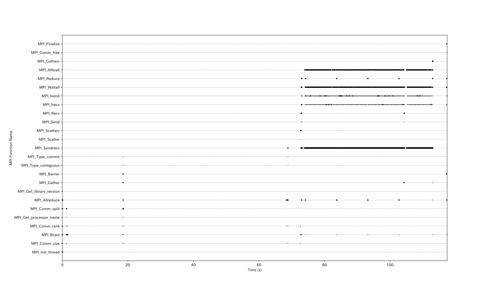

# mpitrace
MPI プログラムの MPI 関数呼び出しをプロファイリングするプログラム

## Note
プロファイリング対象のMPI関数は [OpenMPI](https://www.open-mpi.org/) v5.0.4 を作者の自環境でコンパイルした際の mpi.h をもとにしている．
このため，Fortran や 別 OS といった異なる環境では，すべての MPI 関数が対象となるわけではない．
本プログラムが対象とする MPI 関数は [mpi-function-list.txt](./mpi-function-list.txt) に記述している．

## Usage
* コンパイル (Ruby, Cコンパイラが入っていること)
  ```bash
  make
  ```

* MPI のプロファイリング
  ```
  mpirun -x "LD_PRELOAD=/path/to/mpitrace/mpitrace.so" your_mpi_program
  ```

* ログファイルを時系列で可視化
  ```
  ./log2graph mpitrace.123456789.log
  ```

## Log File Format
* 上記コマンドを実行すると，実行した際のワーキングディレクトリ上に mpitrace.<PID>.log というログファイルが生成される．
* <PID> には MPI プログラムの PID が入る．
* 複数ノード上で実行した場合，各ノードの同パス上に生成される．
* ログファイルは以下のフォーマットに従った CSV 形式で出力される．
```
MPI_Init_thread, 1721647142.613407534, 1721647142.667569044, 0.023832995, 0.047889931
MPI_Comm_size, 1721647142.667583925, 1721647142.667585381, 0.047904497, 0.047905888
MPI_Bcast, 1721647142.667587638, 1721647142.679189774, 0.047908178, 0.058816104
:
```
* 第1カラム: 呼び出されたMPI関数の名前
* 第2カラム: 呼び出された直後の実時間 (CLOCK_REALTIME)
* 第3カラム: 呼び出しから返る直前の実時間 (CLOCK_REALTIME)
* 第4カラム: 呼び出された直後のCPU時間 (CLOCK_THREAD_CPUTIME_ID)
* 第5カラム: 呼び出しから返る直前のCPU時間 (CLOCK_THREAD_CPUTIME_ID)

## Graph
* log2graph を実行すると，指定したログファイルをシーケンス図にして表示する．

* 縦軸: MPI関数の種別
* 横軸: 時間 (初めてMPI関数が呼び出されてからの経過時間)

## Details
### List of programs
* [mpi-function-list.txt](./mpi-function-list.txt): MPI 関数の返り値型，名前，引数を列挙したファイル．
* [mpi2pmpi](./mpi2pmpi): mpi-function-list.txt から，mpitrace.c を自動作成する Ruby プログラム．
* [log2graph](./log2graph): ログファイルをmatplotlibでシーケンス図にするプログラム．

### Processing Flow
mpitrace.so は MPI プログラムのMPI関数呼び出しを上書きして以下の処理を行う．
1. MPI初期化関数 (MPI_Init, MPI_Init_thread) を上書きし，ログファイルを開く．
2. MPI 関数を呼び出す直前と直後の時間を取得し，ログファイルに記録する．
3. MPI終了関数 (MPI_Finalize) を上書きし，ログファイルを閉じる．
